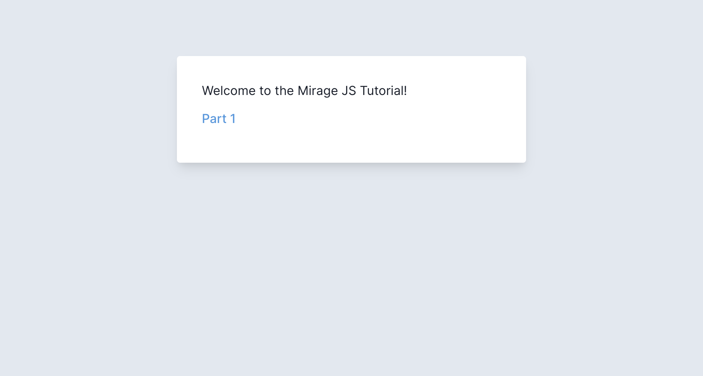

# Intro

This tutorial will teach you the fundamentals of mocking out any HTTP API with Mirage.
While Mirage can be used to mock out GraphQL APIs, in this tutorial we'll be using REST.

You'll learn Mirage by **mocking out the API for a Reminders app**. The app is written in React, but you don't need to know React to follow along since you'll only be writing Mirage code.

Here's an example of the final result:

[**mirage-react-demo.netlify.app**](https://mirage-react-demo.netlify.app/) ([source](https://github.com/miragejs/react-demo))

## Setup

First let’s get your development environment ready. You'll need [**Node.js**](https://nodejs.org/en/) installed, and you'll be using your own text editor and terminal app.

Next, download the tutorial and install its dependencies:

```shell
npx degit github:miragejs/tutorial && cd tutorial && yarn
```

Then start your app:

```shell
yarn start
```

This should run a development server on **port 3000**.

Open [http://localhost:3000](http://localhost:3000) in your browser and you should see a page that looks like this:



If you do, you're ready to start mocking!
