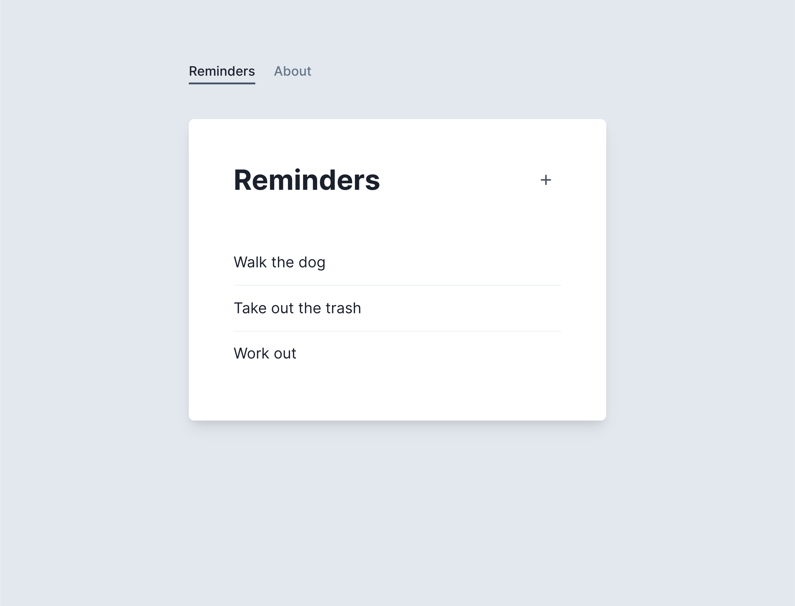

# Part 1 – Static GET Handler

As you can see from the interface, our Reminders app is trying to make an API request for its data, but the request is failing.


That's because there's no API server for our app to talk to. Let's use Mirage to mock out the failing API request.

Open the `src/server.js` file in your editor, import `createServer` from `miragejs`, and export a default function that creates a new server:

```js
// src/server.js
import { createServer } from "miragejs"

export default function () {
  createServer()
}
```

We import and run this function for you in `index.js`, but in your own apps you can set it up however you like.

Back in the app, if you open your JavaScript console, you should see an error from Mirage:

> Mirage: Your app tried to GET '/api/reminders', but there was no route defined to handle this request.

This means Mirage is running, and that the Reminders app is making a GET request that hasn't been mocked out.

We can mock it out using the `routes()` hook. Update the Server in your app by copying in the highlighted code:

```js{4-10}
import { createServer } from "miragejs"

export default function () {
  createServer({
    routes() {
      this.get("/api/reminders", () => ({
        reminders: [],
      }))
    },
  })
}
```

The `routes()` hook is where we define out route handlers, and the `this.get()` method lets us mock out GET requests. The first argument is the URL we're handling (`/api/reminders`) and the second argument is a function that responds to our app with some data.

You should see the app reload and then render a message saying "All done!":


Open the console and you'll see Mirage handled the request with a 200 status code and the object from our handler.

Let's add some data to our response:

```js{4-8}
createServer({
  routes() {
    this.get("/api/reminders", () => ({
      reminders: [
        { id: 1, text: "Walk the dog" },
        { id: 2, text: "Take out the trash" },
        { id: 3, text: "Work out" },
      ],
    }))
  },
})
```

The app now renders this data.



Congrats – you just wrote your first Mirage route handler!

## Takeaways

- Mirage runs in the browser, so there's no new terminal processes to manage
- Returning data from Mirage is as fast and easy as writing frontend code
- You never alter your application code to consume data from Mirage – your app thinks it's talking to a real network
