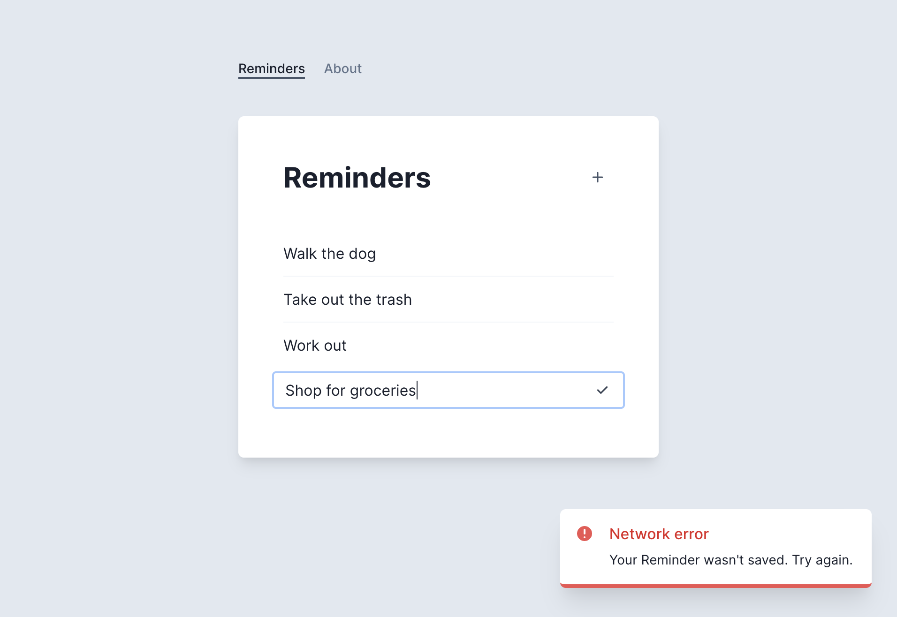
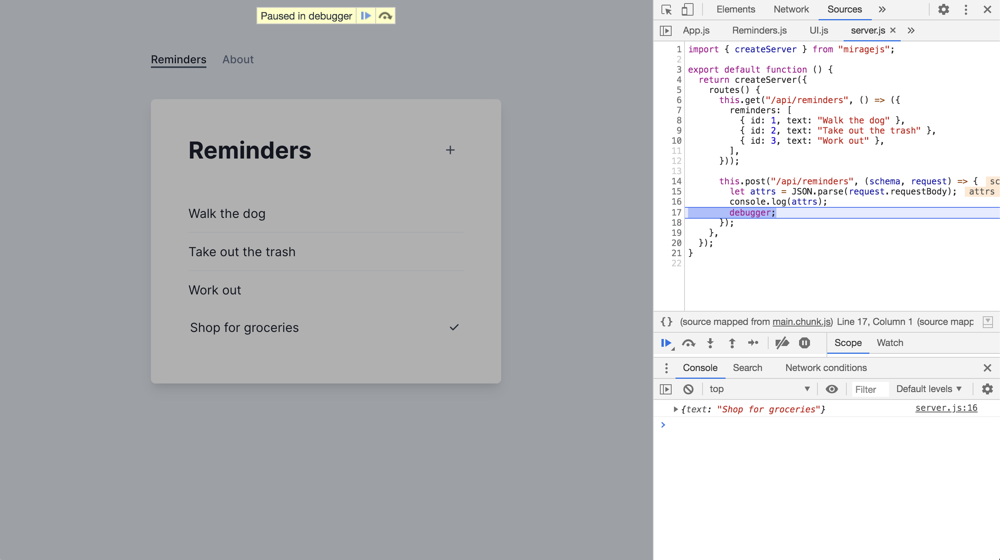

# Part 2 – Static POST Handler

Try adding a Reminder to "Shop for groceries" by filling out the input field and hitting enter. You should see another error:



If you check your console you'll see this message:

> Mirage: Your app tried to POST '/api/reminders', but there was no route defined to handle this request.

Let's mock out this POST request. Start by copying the highlighted lines into your server's `routes()` hook:

```js{11-15}
createServer({
  routes() {
    this.get("/api/reminders", () => ({
      reminders: [
        { id: 1, text: "Walk the dog" },
        { id: 2, text: "Take out the trash" },
        { id: 3, text: "Work out" },
      ],
    }))

    this.post("/api/reminders", (schema, request) => {
      let attrs = JSON.parse(request.requestBody)
      console.log(attrs)
      debugger
    })
  },
})
```

We're using `this.post` to handle this request. We're also using the `request` argument to access the data sent over from our application. The `request.requestBody` property contains the request body as a JSON string, so after parsing it we log it to the console.

After saving this new code, make sure your JavaScript console is open and try adding a Reminder for "Shop for groceries" again. The devtools should hit the `debugger` statement in your route handler, and you should see the object `{ text: "Shop for groceries" }` logged to your console.



Press the Play button to allow JavaScript to continue execution. Mirage will respond successfully with a 201 status code, but the app will crash with an error:

> Cannot read property 'id' of undefined

Here's a screenshot of what you should see:


Our app is expecting the API server to respond with an object that looks like this:

```json
{
  "reminder": {
    "id": 4,
    "text": "Shop for groceries"
  }
}
```

but right now we're not returning anything from our route handler.

Let's return an object that looks like this. We'll use the `attrs` from our request, and also add in an `id` key. We'll use 4 since our existing reminders use ids 1 through 3.

Here's our new route handler – copy this into your server:

```js
this.post("/api/reminders", (schema, request) => {
  let attrs = JSON.parse(request.requestBody)
  attrs.id = 4

  return { reminder: attrs }
})
```

Now when you add a todo, there's no more errors and the app updates correctly.

Unless you try to create a second todo! Try adding "Shop for groceries" then "Clean the bathroom". React will throw an error on the second new reminder:

> Encountered two children with the same key, '4'.

We shouldn't hard-code the `id` as 4. Let's use an incrementing number instead.

Here's the final server:

```js{13-19}
import { Server } from "miragejs"

new Server({
  routes() {
    this.get("/api/reminders", () => ({
      reminders: [
        { id: 1, text: "Walk the dog" },
        { id: 2, text: "Take out the trash" },
        { id: 3, text: "Work out" },
      ],
    }))

    let newId = 4
    this.post("/api/reminders", (schema, request) => {
      let attrs = JSON.parse(request.requestBody)
      attrs.id = newId++

      return { reminder: attrs }
    })
  },
})
```

Now our app works no matter how many reminders we create.

## Takeaways

- Mirage can handle POST requests
- Route handlers can use data from the request when constructing the response
- Route handlers should faithfully recreate important details of production server endpoints, like unique IDs
