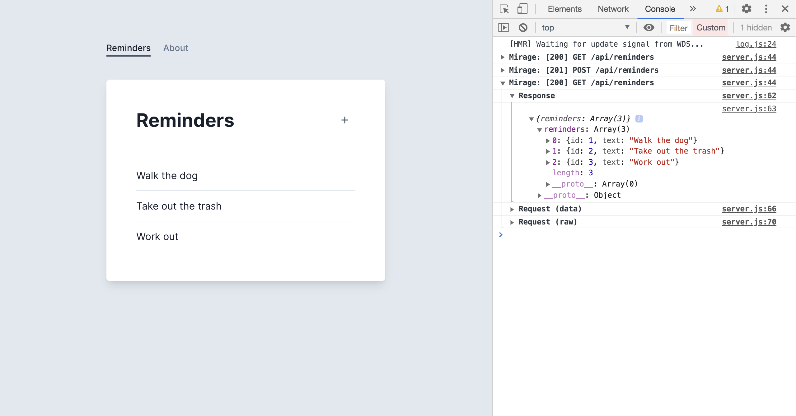

# Part 3 – Dynamic Handlers

We've mocked out two API routes so far, but we have a problem.

After reloading your app, try adding a new Reminder to "Buy groceries" and save it. Then, click the About link in the header, and then click Home again.

The original three Reminders will reload, but our newly created one isn't in the list.



That's because our GET handler is _static_ and returns the same three hard-coded todos every time. We've broken the _referential integrity_ of our application data, and it no longer behaves the same way our production API will.

Let's fix this by using Mirage's data layer. We'll start with our GET handler.

```js{1,4-6,9-11}
import { createServer, Model } from "miragejs"

createServer({
  models: {
    reminder: Model,
  },

  routes() {
    this.get("/api/reminders", (schema) => {
      return schema.reminders.all()
    })

    let newId = 4
    this.post("/api/reminders", (schema, request) => {
      let attrs = JSON.parse(request.requestBody)
      attrs.id = newId++

      return { reminder: attrs }
    })
  },
})
```

First we import `Model` and define a `reminder` model. Next, we update our GET route handler to use the `schema` argument to respond with all the reminders in Mirage's database at the time of the request.

Once you save and reload the app, you should see the "All done!" message again. That's because Mirage's database starts out empty.

Next update your POST handler to create new Reminder models:

```js{13-17}
import { createServer, Model } from "miragejs"

createServer({
  models: {
    reminder: Model,
  },

  routes() {
    this.get("/api/reminders", (schema) => {
      return schema.reminders.all()
    })

    this.post("/api/reminders", (schema, request) => {
      let attrs = JSON.parse(request.requestBody)

      return schema.reminders.create(attrs)
    })
  },
})
```

The `schema` argument is how we both access and create data in Mirage.

Now, save your changes and try to create some Reminders in your app. If you inspect the response, you'll see that the data layer automatically assigns autoincrementing IDs to new records.

Also, after you've created some reminders, click About then click Home again. You should see all the reminders you've created appear again. Because all our route handlers are interacting with Mirage's schema, we've restored the referential integrity of our data, and our app behaves as expected.

## Takeaways

- Mirage has a database that acts as a single source of truth for your mock server data
- Route handlers should read from and modify the database via the `schema` argument in order to preserve the referential integrity of your mock data across write operations
