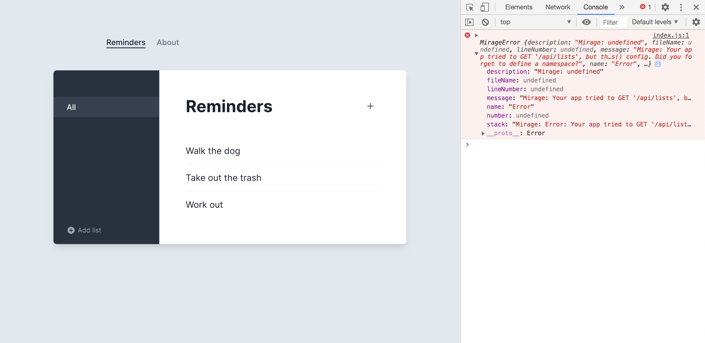

# Part 6 – Relationships

There's another feature in this app – Lists. If you click the button on the left side of the Reminders panel, a side panel will open up that shows the different Lists in this app.



But right now, we just see an error in our console because our app is expecting to fetch the lists from `/api/lists`. Let's mock out this endpoint.

To start, we'll define a new `list` model at the top of our server:

```js{2}
models: {
  list: Model,
  reminder: Model,
}
```

We'll also add a new route handler for a GET to `/api/lists` that returns all the lists:

```js
this.get("/api/lists", (schema, request) => {
  return schema.lists.all()
})
```

Mirage now responds with a 200, but no lists. Let's create some in `seeds()`:

```js{6-7}
seeds(server) {
  server.create("reminder", { text: "Walk the dog" });
  server.create("reminder", { text: "Take out the trash" });
  server.create("reminder", { text: "Work out" });

  server.create("list", { name: "Home" });
  server.create("list", { name: "Work" });
}
```

Now when we open the sidebar, we see our two new lists "Home" and "Work" being rendered.

Try clicking on a list. You'll see an error because our app is expecting another API endpoint to exist: `/api/lists/1/reminders`. This is how it fetches the reminders for a specific list. Let's see how to mock it out.

The easiest way to mock out endpoints that deal with _relational data_ in Mirage is to use **associations**. We'll start by using Mirage's association helpers to model this data.

In this app, there's a one-to-many relationship between lists and reminders (a list can have many reminders), so we'll use `hasMany` and `belongsTo` helpers to define this relationship.

Import the helpers and update your models to define this relationship:

```js{1,5-13}
import { createServer, Model, hasMany, belongsTo } from "miragejs"

export default function () {
  createServer({
    models: {
      list: Model.extend({
        reminders: hasMany(),
      }),

      reminder: Model.extend({
        list: belongsTo(),
      }),
    },

    // rest of server
  })
}
```

Now Mirage is aware that the `list.reminders` and `reminder.list` properties are relationships, so we can start using them within our route handlers.

Let's mock out `/api/lists/:id/reminders` using our new relationships. This endpoint should look up the corresponding List, and respond with all the Reminders belonging to that list.

Here's the code:

```js
this.get("/api/lists/:id/reminders", (schema, request) => {
  let listId = request.params.id
  let list = schema.lists.find(listId)

  return list.reminders
})
```

We use a dynamic segment of `:id` which corresponds to the List we clicked. We then use that ID to look up the corresponding list in Mirage's data layer. Finally, we return the reminders associated with that list.

Copy this route handler into your Mirage server definition and try clicking each list. You shouldn't see an error anymore. But you also won't see any reminders. That's because the reminders we've created so far are not associated with any list – we just created them on their own.

To create a reminder for a particular list, we can use our new relationships.

```js{7-11}
seeds(server) {
  // Unassociated reminders
  server.create("reminder", { text: "Walk the dog" });
  server.create("reminder", { text: "Take out the trash" });
  server.create("reminder", { text: "Work out" });

  let homeList = server.create("list", { name: "Home" });
  server.create("reminder", { list: homeList, text: "Do taxes" });

  let workList = server.create("list", { name: "Work" });
  server.create("reminder", { list: workList, text: "Visit bank" });
}
```

Now, clicking "Home" should show the "Do taxes" reminder. And if you click All, the app will hit the `/api/reminders` endpoint which will still return out all the Reminders in our system – both those associated with a List and those that are on their own.

Finally, try making a new reminder for a specific list in the UI. Click Work, then add a reminder to "Respond to Jill". If you click around the app, you'll see it's properly associated with the Work list. (It shows up on Work and All, but not Home).

This is because our UI already sends a `{ listId }` when we create a reminder while on a list. To see this, let's add a log to our existing POST route handler to inspect the attrs from the request:

```js{3}
this.post("/api/reminders", (schema, request) => {
  let attrs = JSON.parse(request.requestBody)
  console.log(attrs)

  return schema.reminders.create(attrs)
})
```

When creating an unassociated todo, the attrs are `{ text: "New todo" }`, but an associated todo has attrs like `{ text: "Respond to Jill", listId: "2" }`.

When we defined our relationship, Mirage set up special attributes on our models known as foreign keys. These are how it keeps track of which models are associated with each other. Setting a foreign key like `listId` or `reminderIds: []` is enough to update a relationship and have it reflected across all your Mirage route handlers.

So, we don't have to update our POST handler to accommodate our UI's List feature, since `listId` is already being passed into `reminders.create()`.

Mirage's association helpers are flexible enough to model nearly any data scenario, making your job easier when it comes time to mock endpoints that deal with relationships.

## Takeaways

- Mirage lets you define and access relational data
- Use the `belongsTo` and `hasMany` helpers to define named relationships on your models
- Use relationships in route handlers to return a model or collection that's associated with other models
- Mirage uses simple foreign keys to keep track of relational data
