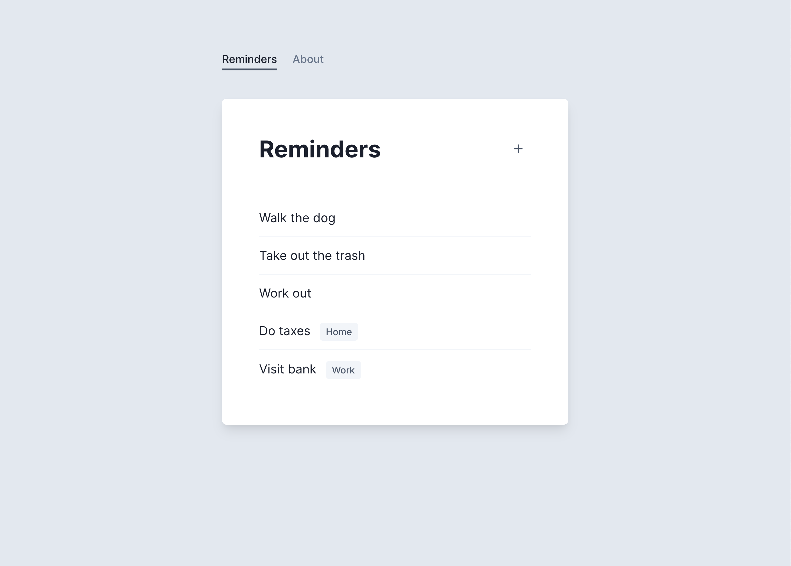

# Part 7 – Serializers

Mirage also has a Serializer layer that can help with the kinds of transforms that are commonly applied to JSON payloads, like whether your object keys are camelCased or snake_cased, or how related data gets included in a response.

Our Reminders app has another feature that we haven't seen because of how we've mocked our responses so far. It will show the list a Reminder comes from when on the "All" home screen. In order to make this work, our app is expecting the GET request to `/api/reminders` to return each Reminder's List embedded alongside it, like this:

```json
// GET /api/reminders

{
  "reminders": [
    { "id": "1", "text": "Walk the dog" },
    { "id": "2", "text": "Take out the trash" },
    { "id": "3", "text": "Work out" },
    { "id": "4", "text": "Do taxes", "list": { "name": "Home", "id": "1" } },
    { "id": "5", "text": "Visit bank", "list": { "name": "Work", "id": "2" } }
  ]
}
```

Serializers leverage Mirage's data layer to help you mock complex API responses like this one. Let's see how.

We'll import `RestSerializer`, set it as the serializer for our Reminder model, and tell it to embed any related lists:

```js{6,10-15}
import {
  createServer,
  Model,
  hasMany,
  belongsTo,
  RestSerializer,
} from "miragejs"

createServer({
  serializers: {
    reminder: RestSerializer.extend({
      include: ["list"],
      embed: true,
    }),
  },

  // rest of definition
})
```

This new `serializers` key is an option that lets us define serializers on a per-model basis. We could also set an `application` serializer if we wanted to apply general transformations to all our responses.

The `RestSerializer` class that we're using is one of three named serializers included in Mirage, and is a good starting point for many REST APIs. There's also the `ActiveModelSerializer` for Rails-like APIs, and the `JSONAPISerializer` for APIs that follow the JSON:API spec.

Finally, we added two customizations to our RestSerializer:

- First, `include: ['list']` tells Mirage that every time it encounters a Reminder model in the response of a route handler, it should include its associated List (if it has one).

- Second, `embed: true` tells Mirage _how_ to serialize the included resources. By default they are side-loaded but this API expects them to be embedded, as shown in the JSON snippet above.

With those changes added, if you refresh your app on the "All" page you should see List labels next to the Reminders that belong to a list:



Try using the UI to create more reminders for specific lists, then coming back to All. The labels should show up for your new data.

## Takeaways

- Mirage's Serializer layer can be used to transform your JSON payloads
- Some common Serializer concerns are changing the shape of your JSON payloads (e.g. whether to include a key in the root), the conventions around formatting for compound words (e.g. camelCase vs. snake_case), and how and when related data should be included
