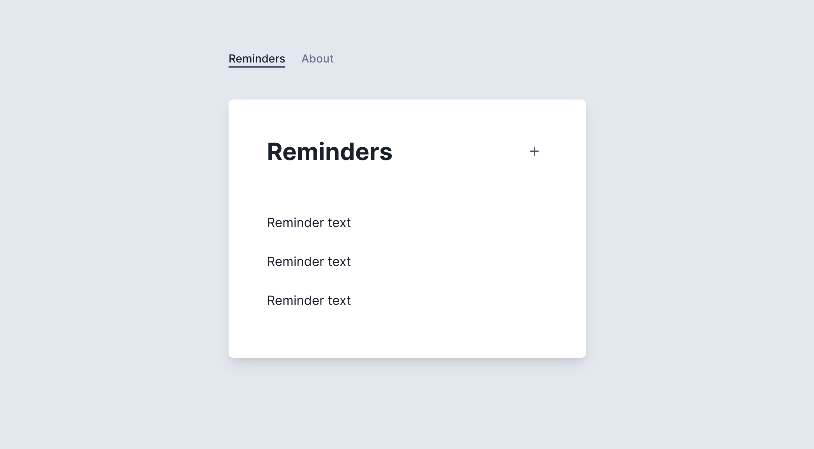
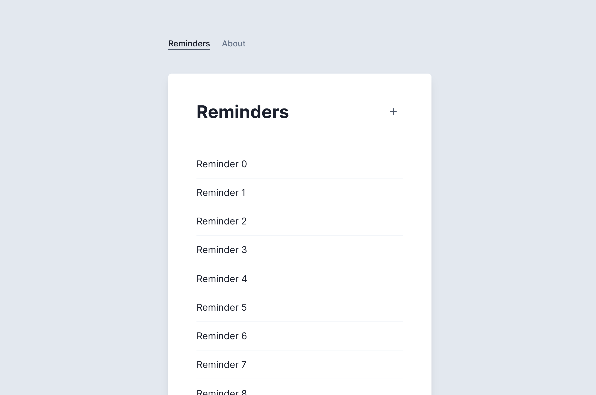
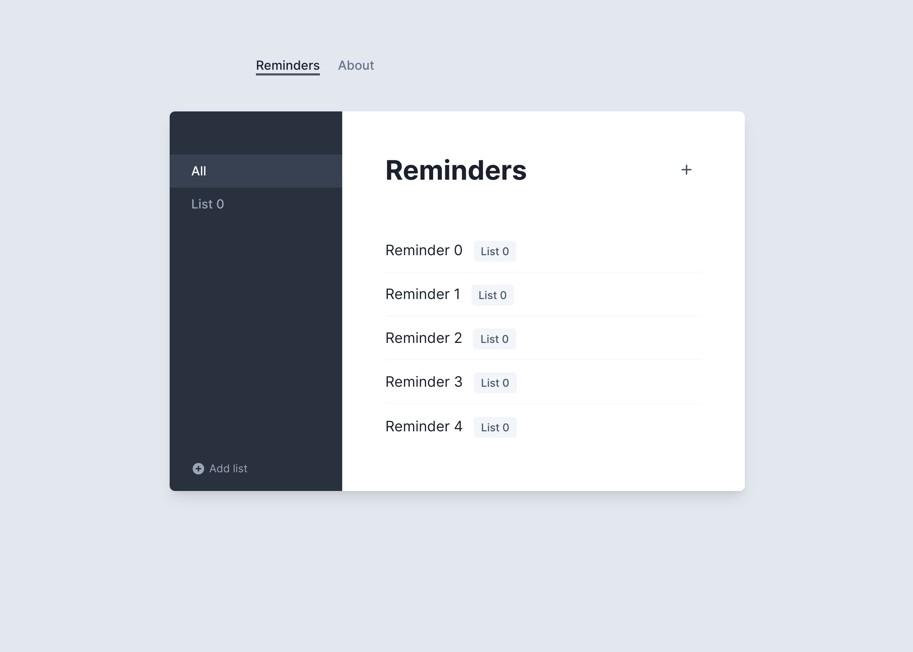
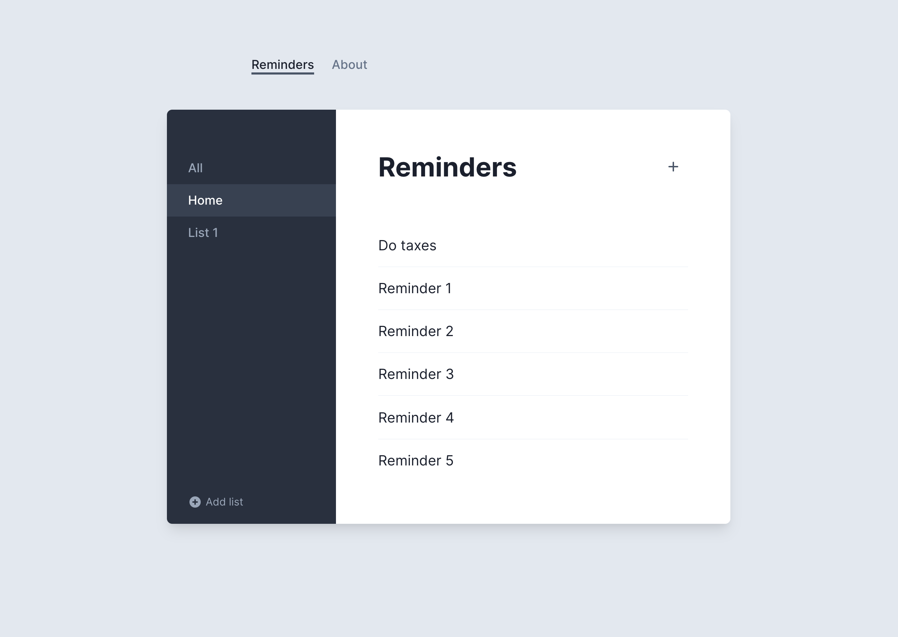
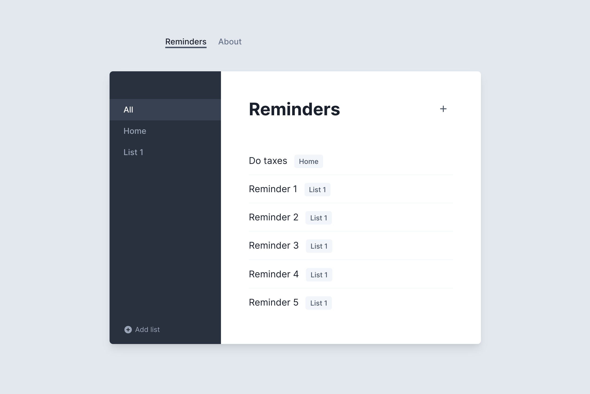

# Part 8 – Factories

Mirage includes a Factory layer to help simplify the process of seeding your Mirage server with realistic, relational data.

Currently, if we want to make a realistic Reminder, we need to do something like this in our `seeds()` hook:

```js
seeds(server) {
  server.create("reminder", { text: "Walk the dog" });
}
```

Having to always specify every attribute for every model you create can add a lot of boilerplate to your code, especially during testing. It gets even more complicated when relationships are always required.

Factories are the perfect place to encode the constraints of your data, making it easier for you to quickly create valid graphs of data. Let's see how.

For this app, Reminders always have a `text` property. Let's define a Reminder factory that defines this:

```js{1,14-18}
import { createServer, Model, hasMany, belongsTo, Factory } from "miragejs"

createServer({
  models: {
    list: Model.extend({
      reminders: hasMany(),
    }),

    reminder: Model.extend({
      list: belongsTo(),
    }),
  },

  factories: {
    reminder: Factory.extend({
      text: "Reminder text",
    }),
  },

  // ...rest of server
})
```

First we import `Factory`, and then call `.extend(config)` on it passing in an config object. Keys of the config correspond to properties on your models.

Now we can update our `seeds()` to just call `server.create('reminder')`, without passing anything else in:

```js
seeds(server) {
  server.create("reminder");
  server.create("reminder");
  server.create("reminder");
}
```

With this seed data the app looks like this:



Valid, but not very realistic! We can use function properties to make this a bit more dynamic:

```js
factories: {
  reminder: Factory.extend({
    text(i) {
      return `Reminder ${i}`
    }
  }),
},
```

Now each reminder has its own unique text. Libraries like [faker.js](https://github.com/marak/Faker.js/) also work well in function properties to create more realistic data.

Combined with `server.createList`, we can now easily create many Reminders using our Factory definition:

```js
seeds(server) {
  server.createList("reminder", 100);
}
```

This gives us a bigger dataset:



But what if we want to override specific properties that we've defined on our Factory? We can always do that by passing in attributes into `server.create()`:

```js
seeds(server) {
  // Create a specific reminder
  server.create('reminder', { text: 'Walk the dog' })

  // Create 5 more generic reminders
  server.createList("reminder", 5);
}
```

Here's the result:


Let's turn to our List model. We'll start by defining a Factory for it:

```js{2-6}
factories: {
  list: Factory.extend({
    name(i) {
      return `List ${i}`;
    },
  }),

  reminder: Factory.extend({
    text(i) {
      return `Reminder ${i}`;
    },
  }),
},
```

Now if we want to make generic Lists and Reminders, we don't need to specify any attributes:

```js
seeds(server) {
  server.create("list", {
    reminders: server.createList("reminder", 5),
  });
}
```

As you can see, passing Reminders into our List on creation still lets us create valid graphs of relational data:



What if we wanted to make it even easier to create a List with many reminders? We can use the `afterCreate` hook on our List Factory, passing in our newly created list into any new Reminders we create:

```js{7-9}
factories: {
  list: Factory.extend({
    name(i) {
      return `List ${i}`;
    },

    afterCreate(list, server) {
      server.createList('reminder', 5, { list })
    }
  }),

  reminder: Factory.extend({
    text(i) {
      return `Reminder ${i}`;
    },
  }),
},
```

Now with just a `server.create('list')`, we can have a valid List with 5 Reminder models, like we had before:

```js
seeds(server) {
  server.create("list")
}
```

But what if we wanted to bring back some of our more curated, realistic data, either because we're testing something specific or because we want less generic data in development?

Currently, if we do something like this:

```js
seeds(server) {
  server.create("list", {
    name: "Home",
    reminders: [server.create("reminder", { text: "Do taxes" })],
  });

  server.create("list")
}
```

we'll see that our `afterCreate` hook is triggered for both lists, and now our Home list has 5 randomly generated reminders along our specific "Do taxes" one:



We can updadate our `afterCreate` logic to first check if our newly created List already has Reminders passed into it, and only create default reminders if it doesn't:

```js{8-10}
factories: {
  list: Factory.extend({
    name(i) {
      return `List ${i}`;
    },

    afterCreate(list, server) {
      if (!list.reminders.length) {
        server.createList('reminder', 5, { list })
      }
    }
  }),

  reminder: Factory.extend({
    text(i) {
      return `Reminder ${i}`;
    },
  }),
},
```

Now our same seeds logic lets us easily create a curated "Home" list with only the "Do taxes" reminder we passed in, while our plain call to `server.create('list')` quickly scaffolds out a generic list with five reminders for us:



Factories have [even more features](/docs/main-concepts/factories) that give you flexible ways to create data scenarios, so you can do things like quickly switch your development environment from an anonymous user to an authenticated user, or set up just the data you need within a test.

Using Factories well is one of the best ways to take advantage of all the capabilities of Mirage's data layer.

## Takeaways

- Factories are like blueprints that help you easily create graphs of relational data
- You can use static values or functions as attributes
- You can override Factory defaults wherever you call `server.create()`
- Use the `afterCreate` hook to perform additional logic, like automatically creating related data for a model
