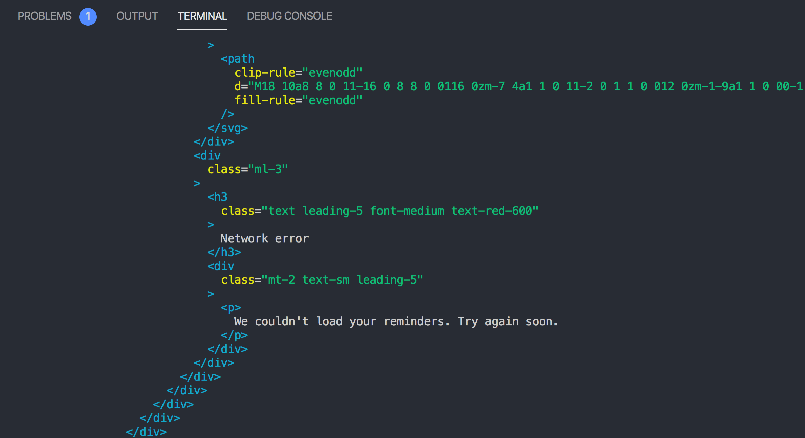
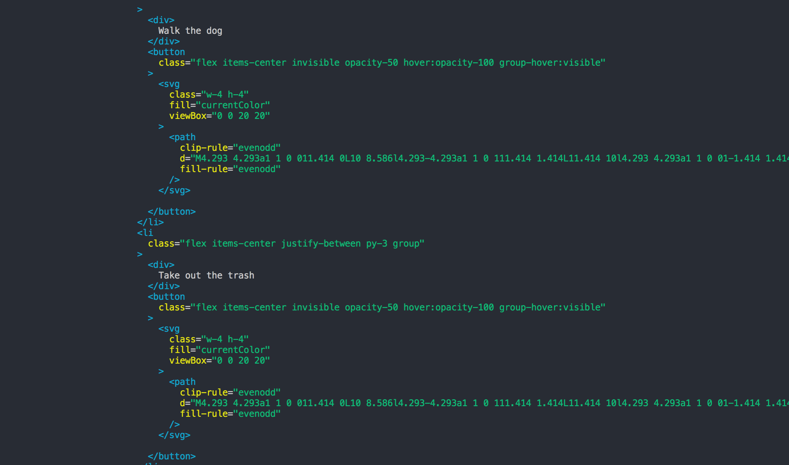
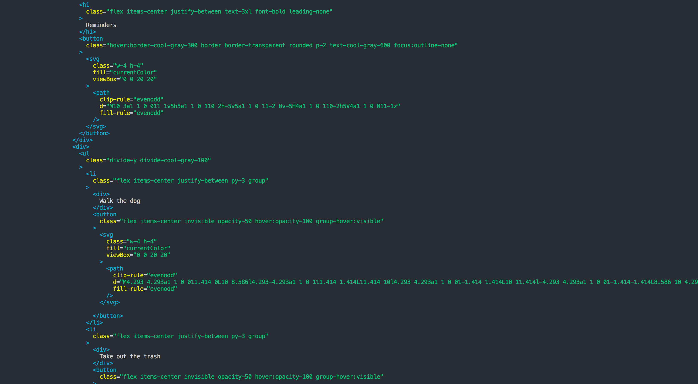
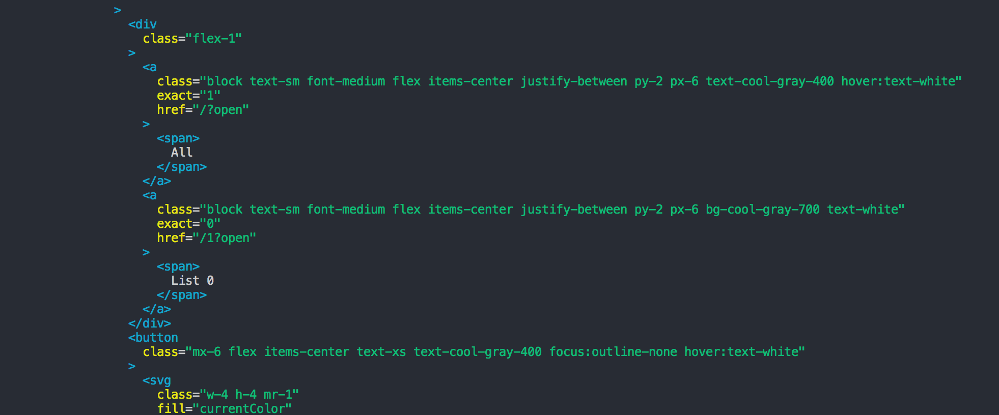

# Part 9 – Testing

In this final section, we're going to learn how to use Mirage to test our app in a variety of different server states.

Our project is already set up with **Jest** and **Testing Library**. We've also provided a `visit(url)` helper that renders our Reminders app at a given URL.

Let's open `__tests__/app.js` and write our first test.

We want to verify that our app shows "All done!" when there are no reminders. Here's the code for the test – go ahead and copy it into your project:

```js
// __tests__/app.js
import { visit } from "../lib/test-helpers"
import { screen, waitForElementToBeRemoved } from "@testing-library/react"

test("it shows a message when there are no reminders", async () => {
  visit("/")
  await waitForElementToBeRemoved(() => screen.getByText("Loading..."))

  expect(screen.getByText("All done!")).toBeInTheDocument()
})
```

No in your terminal, run `yarn test`. Jest should start a watcher that will re-run your tests every time you make a change.

After the test finishes its first run, you should see an error: "Unable to find an element with the text: All done!". You should also see an error that says "Network request failed."

And if you look at the debug output, you'll even see the familiar network error UI showing up in the DOM:



Just like in Part 1, this is happening because our app is making its initial fetch to `/api/reminders` but there's no server to respond to it. It's time to bring our Mirage server into the test.

Let's import our `makeServer` function and run it at the beginning of our test:

```js{3,6}
import { visit } from "../lib/test-helpers"
import { screen, waitForElementToBeRemoved } from "@testing-library/react"
import makeServer from "../server"

test("it shows a message when there are no reminders", async () => {
  makeServer()
  visit("/")
  await waitForElementToBeRemoved(() => screen.getByText("Loading..."))

  expect(screen.getByText("All done!")).toBeInTheDocument()
})
```

Now we have a new error:

> Unable to find an element with the text: All done!

If we look at the debug output, we'll see that the DOM has the existing reminders we created in `seeds()` from where we left off in the previous part:



This makes sense, since we're creating the exact same Mirage server as we do in development, and we seeded that server with these five reminders to help us develop the app.

So, one way we could solve this would be to go back to our server definition and delete all our `seeds()` data. But there's a better way that doesn't involve changing our dev seeds: we can start our Mirage server in "test" mode using the `environment` option.

To see how this works, open your `server.js` file and add the `environment: 'test'` option:

```js{6}
// server.js
import { createServer } from "miragejs"

export default function () {
  return createServer({
    environment: "test",

    // rest of config
  })
}
```

Save that change, and once your test re-runs, it should pass!

So, what does the `"test"` environment do to our server? Two things: first, it sets the `timing` to 0 so that our tests run fast; but second and more importantly, it skips the `seeds()` hook.

So, we get to reuse all of our models, serializers, factories and routes, but keep the `seeds()` data set apart for development mode. In testing, we will use each test to set up the data for our server in exactly the state we need for each test.

So for our current test, since we're just creating the server, that database will start out empty. And that's why we see the "All done" message assertion pass – which is exactly what we want for this test.

If you switch back to your development server (or run `yarn start` in another terminal window), you'll notice that the Reminders we created in `seeds()` no longer show up, and that's because our dev server is also running in test mode. Let's fix this by updating the function we're exporting from `server.js` to take in an environment argument, and we'll use that to set our server's environment:

```js
export default function (environment = "development") {
  return createServer({
    environment,

    // ...rest of server definition
  })
}
```

Now our dev server is using our seeds again, and has an artificial delay to help us develop, but our test should be failing again. Back in our test file we'll update our call to `makeServer` and pass in an environment of "test"

```js{6}
import { visit } from "../lib/test-helpers"
import { screen, waitForElementToBeRemoved } from "@testing-library/react"
import makeServer from "../server"

test("it shows a message when there are no reminders", async () => {
  makeServer("test")
  visit("/")
  await waitForElementToBeRemoved(() => screen.getByText("Loading..."))

  expect(screen.getByText("All done!")).toBeInTheDocument()
})
```

and now our test passes, but our dev environment still has its own isolated seed data to help us during development!

This is just one way to customize Mirage. In your own projects, how you set up the arguments and choose the defaults are up to you.

Now that we have an easy way to create isolated Mirage servers in our tests, let's keep going and see how we can write a test for our app given that three Reminders already exist on the server.

We'll start by copying and pasting our previous test, and updating the description:

```js{1}
test("it shows existing reminders", async () => {
  makeServer("test")
  visit("/")
  await waitForElementToBeRemoved(() => screen.getByText("Loading..."))

  expect(screen.getByText("All done!")).toBeInTheDocument()
})
```

Since we want to alter our server before we render our app, we can assign the return value of `makeServer` into a local variable, and use that variable to seed our server with Reminder models, in exactly the same way we do within our `seeds()` hook.

In fact, let's copy those three `server.create` statements and bring them right into our test:

```js{2-5}
test("it shows existing reminders", async () => {
  let server = makeServer("test")
  server.create("reminder", { text: "Walk the dog" })
  server.create("reminder", { text: "Take out the trash" })
  server.create("reminder", { text: "Work out" })

  render(<App />)
  await waitForElementToBeRemoved(() => screen.getByText("Loading..."))

  expect(screen.getByText("All done!")).toBeInTheDocument()
})
```

When we run this test we should see a warning:

> You created a second Pretender instance while there was already one running

Mirage uses the Pretender library under the hood, and Pretender is telling us we have two servers that are colliding with each other. We need to use the `server.shutdown()` method to clean up after our previous test, as well as the end of this new one.

```js{2,8,21}
test("it shows a message when there are no reminders", async () => {
  let server = makeServer("test")
  render(<App />)

  await waitForElementToBeRemoved(() => screen.getByText("Loading..."))

  expect(screen.getByText("All done!")).toBeInTheDocument()
  server.shutdown()
})

test("it shows existing reminders", async () => {
  let server = makeServer("test")
  server.create("reminder", { text: "Walk the dog" })
  server.create("reminder", { text: "Take out the trash" })
  server.create("reminder", { text: "Work out" })

  render(<App />)
  await waitForElementToBeRemoved(() => screen.getByText("Loading..."))

  expect(screen.getByText("All done!")).toBeInTheDocument()
  server.shutdown()
})
```

Now we don't see the Pretender warning. But when we run this test, we get a failure since "All done!" isn't showing up anymore. Instead, if we look at the debug output, we see our three reminders in the HTML:



And the UI is showing exactly what we expect! Let's update our assertion:

```js{10-12}
test("it shows existing reminders", async () => {
  let server = makeServer("test")
  server.create("reminder", { text: "Walk the dog" })
  server.create("reminder", { text: "Take out the trash" })
  server.create("reminder", { text: "Work out" })

  render(<App />)
  await waitForElementToBeRemoved(() => screen.getByText("Loading..."))

  expect(screen.getByText("Walk the dog")).toBeInTheDocument()
  expect(screen.getByText("Take out the trash")).toBeInTheDocument()
  expect(screen.getByText("Work out")).toBeInTheDocument()
  server.shutdown()
})
```

And with that, both our tests are now passing!

As you can see, each test naturally gives us an isolated place to alter the state of our Mirage server for the sake of whatever scenario we're testing. Since we cleanup after each test, none of these alterations leak from one test into another.

Since each test will start and stop our base Mirage server, let's refactor our code to do this work in Jest's `beforeEach` and `afterEach` hooks:

```js{5-13}
import { visit } from "../lib/test-helpers"
import { screen, waitForElementToBeRemoved } from "@testing-library/react"
import makeServer from "../server"

let server

beforeEach(() => {
  server = makeServer("test")
})

afterEach(() => {
  server.shutdown()
})

test("it shows a message when there are no reminders", async () => {
  visit("/")

  await waitForElementToBeRemoved(() => screen.getByText("Loading..."))

  expect(screen.getByText("All done!")).toBeInTheDocument()
})

test("it shows existing reminders", async () => {
  server.create("reminder", { text: "Walk the dog" })
  server.create("reminder", { text: "Take out the trash" })
  server.create("reminder", { text: "Work out" })

  visit("/")
  await waitForElementToBeRemoved(() => screen.getByText("Loading..."))

  expect(screen.getByText("Walk the dog")).toBeInTheDocument()
  expect(screen.getByText("Take out the trash")).toBeInTheDocument()
  expect(screen.getByText("Work out")).toBeInTheDocument()
})
```

Our tests have become a bit higher level and more expressive, as they avoid lower-level details and stay focused on real-world user stories: _given_ three Reminders exist on the server, _when_ a user visits the app, _then_ they expect to see them on the page.

Let's write one more test. We'll test that we can create a new Reminder for a specific list.

We'll start our test off by seeding our Mirage server with a list, and then we'll visit the URL for that list:

```js
test("it can add a reminder to a list", async () => {
  let list = server.create("list")

  visit(`/${list.id}`)
  await waitForElementToBeRemoved(() => screen.getByText("Loading..."))
})
```

Note how useful it can be to use data from Mirage within our test. If you want to get a sense of the rendered output at this point, you could use the `?open` query param and call `screen.debug()` to see our generated list in the output:

```js{4,7}
test("it can add a reminder to a list", async () => {
  let list = server.create("list")

  visit(`/${list.id}?open`)
  await waitForElementToBeRemoved(() => screen.getByText("Loading..."))

  screen.debug()
})
```

You should see "All" and "List 0" in the sidebar UI:



Now if we create a new Reminder, it should be associated with this list. Let's go through the steps:

```js{7-9}
test("it can add a reminder to a list", async () => {
  let list = server.create("list")

  visit(`/${list.id}?open`)
  await waitForElementToBeRemoved(() => screen.getByText("Loading..."))

  userEvent.click(screen.getByTestId("add-reminder"))
  await userEvent.type(screen.getByTestId("new-reminder-text"), "Work out")
  userEvent.click(screen.getByTestId("save-new-reminder"))

  // assert something
})
```

Now, what should we do after clicking the submit button? If we try to make a Reminder over in our development app, we'll see the text box hides once the Reminder is created.

So in our test, we can wait for the textbox to disappear, and then assert that the new Reminder shows up in the list:

```js{11-13}
test("it can add a reminder to a list", async () => {
  let list = server.create("list")

  visit(`/${list.id}?open`)
  await waitForElementToBeRemoved(() => screen.getByText("Loading..."))

  userEvent.click(screen.getByTestId("add-reminder"))
  await userEvent.type(screen.getByTestId("new-reminder-text"), "Work out")
  userEvent.click(screen.getByTestId("save-new-reminder"))

  await waitForElementToBeRemoved(() => screen.getByTestId("new-reminder-text"))

  expect(screen.getByText("Work out")).toBeInTheDocument()
})
```

And it works!

As one final step, it can often make sense to assert against the state of your Mirage server, just to give you a bit more confidence that your frontend code is doing what you think it is.

In our case, if everything worked right, we should have a new Reminder in Mirage's database, and it should be associated to the list we created. We can add these assertions easily enough right alongside our UI assertion:

```js{14-15}
test("it can add a reminder to a list", async () => {
  let list = server.create("list")

  visit(`/${list.id}?open`)
  await waitForElementToBeRemoved(() => screen.getByText("Loading..."))

  userEvent.click(screen.getByTestId("add-reminder"))
  await userEvent.type(screen.getByTestId("new-reminder-text"), "Work out")
  userEvent.click(screen.getByTestId("save-new-reminder"))

  await waitForElementToBeRemoved(() => screen.getByTestId("new-reminder-text"))

  expect(screen.getByText("Work out")).toBeInTheDocument()
  expect(server.db.reminders.length).toEqual(1)
  expect(server.db.reminders[0].listId).toEqual(list.id)
})
```

You can think of this as a simple way to verify that your UI is sending the right JSON payload over the wire, without having to drop to the lower level of asserting against HTTP request and response data.

---

Whew - that was the longest step of the Tutorial by far, but you accomplished a lot! You've got four tests covering some important functionality of the app, and you were able to reuse your Mirage server making only the changes you need from test to test.

As an exercise you could practice writing more tests to improve the coverage of this suite. Testing is all about making sure you're confident in your code, so much so that you'd be willing to automatically deploy it after doing something like upgrading a dependency.

Here's some things our app can do that we don't have tests for yet:

- The All screen shows all Reminders, along with tags showing which List they belong to
- A List only shows Reminders that belong to that List
- The user can delete a Reminder
- The user can create a List
- The user can delete a List

Writing the rest of these tests will help you get comfortable with important testing practices like keeping your test data minimal and focused, making sure you only assert against things that have changed in your test, and making sure your tests aren't brittle and break due to unrelated changes.

There's a ton more to say here but hopefully you can see how much more pleasant it is to write tests when you're able to leverage a Mirage server that's already been written.

## Takeaways

- Mirage makes it easy to share your mock server between development and testing
- Use the `test` environment for your Mirage server when testing so your tests run fast and the database starts out empty
- Take advantage of the fact that your Mirage server is easily accessible within your tests to do things like visit dynamic URLs or assert against changes made to your server's database
