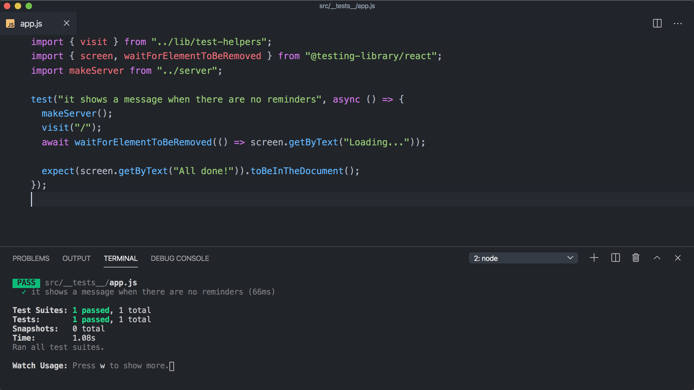

# Part 9 – Testing

In this final section, we're going to learn how to use Mirage to test our app given a variety of different server states.

Our project is already set up with **Jest** and **Testing Library**. We've also provided a `visit(url)` helper that renders our Reminders app at a given URL.

Let's open `src/__tests__/app.js` and write our first test.

We want to verify that our app shows "All done!" when there are no reminders. Here's the code for the test – go ahead and copy it into your project:

```js
// __tests__/app.js
import { visit } from "../lib/test-helpers"
import { screen, waitForElementToBeRemoved } from "@testing-library/react"

test("it shows a message when there are no reminders", async () => {
  visit("/")
  await waitForElementToBeRemoved(() => screen.getByText("Loading..."))

  expect(screen.getByText("All done!")).toBeInTheDocument()
})
```

Now in a new terminal window, run `yarn test`. Jest should start a watcher that will re-run your tests every time you make a change.

After the test finishes its first run, you should see an error:

> Unable to find an element with the text: All done!

You should also see an error that says "Network request failed.

And if you look at the debug output, you'll even see the familiar network error UI from Part 1 of this tutorial showing up in the DOM:


Just like in Part 1, this is happening because our app is making its initial fetch to `/api/reminders` but there's no server to respond to it. It's time to bring our Mirage server into the test.

Let's import our `makeServer` function and run it at the beginning of our test:

```js{3,6}
import { visit } from "../lib/test-helpers"
import { screen, waitForElementToBeRemoved } from "@testing-library/react"
import makeServer from "../server"

test("it shows a message when there are no reminders", async () => {
  makeServer()
  visit("/")
  await waitForElementToBeRemoved(() => screen.getByText("Loading..."))

  expect(screen.getByText("All done!")).toBeInTheDocument()
})
```

Our test is still failing, but if we scroll through the debug output we don't see the message about a failed Network Request anymore.

Instead, we'll see that the DOM is rendering the existing reminders we created in the `seeds()` hook from the previous part of the tutorial:


This makes sense, since we're creating the exact same Mirage server as we do in development, and we seeded that server with these five reminders to help us develop the app.

So, we'd like to have a fresh instance of our Mirage server here, one without any data, so we can verify that the empty state shows the "All done!" message. One way we could accomplish this would be to go back to our server definition and delete all our `seeds()` data.

But there's a better way that doesn't involve changing our dev seeds: we can start our Mirage server in "test" mode using the `environment` option.

To see how this works, open your `server.js` file and add the `environment: 'test'` option:

```js{6}
// server.js
import { createServer } from "miragejs"

export default function () {
  return createServer({
    environment: "test",

    // rest of server
  })
}
```

Save that change, and once your test re-runs, it should pass!

So, what does the `"test"` environment do to our server? A few things: it sets the `timing` to 0 so that our tests run fast; it hides Mirage's logging so your test output remains clean; and most importantly, it skips the `seeds()` hook.

So, we get to reuse all of our models, serializers, factories and routes, but keep the `seeds()` data set apart for development mode. In testing, we will use each test to set up the data for our server in exactly the state we need for that test.

For our current test, we actually want the database to be empty, so we just need to start the server without creating any extra data. That allows Mirage to handle the GET API request correctly, and it responds with an empty dataset. And now our "All done" message assertion is passing, which is exactly what we want for this test.



Now, if you switch back to your development server (or run `yarn start` in another terminal window), you'll notice that the Reminders we created in `seeds()` no longer show up. That's because our dev server is now also running in test mode.

Let's fix this by updating the function we're exporting from `server.js` to take in an environment argument, and we'll use that to set our server's environment:

```js
export default function (environment = "development") {
  return createServer({
    environment,

    // ...rest of server
  })
}
```

Now our dev server is using our seeds again, and has an artificial delay and console logs to help us develop, but our test should be failing again.

Back in our test file we'll update our call to `makeServer` and pass in an environment of "test":

```js{6}
import { visit } from "../lib/test-helpers"
import { screen, waitForElementToBeRemoved } from "@testing-library/react"
import makeServer from "../server"

test("it shows a message when there are no reminders", async () => {
  makeServer("test")
  visit("/")
  await waitForElementToBeRemoved(() => screen.getByText("Loading..."))

  expect(screen.getByText("All done!")).toBeInTheDocument()
})
```

and now our test passes, but our dev environment still has its own isolated seed data to help us during development!

This is just one way to set up Mirage. In your own projects, how you set up the arguments and choose the defaults are up to you. But the key point is you should be sharing your Mirage server across both your development and testing environments.

Now that we have an easy way to create isolated Mirage servers in our tests, let's keep going and see how we can write a test for our UI when three Reminders already exist on the server.

We'll start by copying and pasting our previous test, and updating the description:

```js{1}
test("it shows existing reminders", async () => {
  makeServer("test")
  visit("/")
  await waitForElementToBeRemoved(() => screen.getByText("Loading..."))

  expect(screen.getByText("All done!")).toBeInTheDocument()
})
```

As soon as you save, Jest will run both tests and you should see the following warning:

> You created a second Pretender instance while there was already one running

Mirage uses the Pretender library under the hood, and Pretender is telling us we have two servers that are colliding with each other. We need to use the `server.shutdown()` method to clean up after our previous test, as well as the end of this new one.

We can do that by first opening up our `server.js` file, and making sure our `makeServer` function returns the server instance:

```js{3}
// server.js
export default function (environment = "development") {
  return createServer({
    // rest of server
  })
}
```

And then back in our test, we can assign the return value of `makeServer` to a local variable, and use that to call `server.shutdown()` at the end of each test:

```js{2,8,12,18}
test("it shows a message when there are no reminders", async () => {
  let server = makeServer("test")

  visit("/")
  await waitForElementToBeRemoved(() => screen.getByText("Loading..."))

  expect(screen.getByText("All done!")).toBeInTheDocument()
  server.shutdown()
})

test("it shows existing reminders", async () => {
  let server = makeServer("test")

  visit("/")
  await waitForElementToBeRemoved(() => screen.getByText("Loading..."))

  expect(screen.getByText("All done!")).toBeInTheDocument()
  server.shutdown()
})
```

Now both tests should be running and passing, with no more Pretender warning.

Now let's actually write our second test.

Since we want to test how the UI behaves given the server starts out with three Reminders, we need to create that data before we call `visit('/')`.

We can use our new local `server` variable to seed our server directly in our test, in exactly the same way that we do within our `seeds()` hook. In fact, let's copy those three `server.create` statements and bring them into our test:

```js{3-5}
test("it shows existing reminders", async () => {
  let server = makeServer("test")
  server.create("reminder", { text: "Walk the dog" })
  server.create("reminder", { text: "Take out the trash" })
  server.create("reminder", { text: "Work out" })

  visit("/")
  await waitForElementToBeRemoved(() => screen.getByText("Loading..."))

  expect(screen.getByText("All done!")).toBeInTheDocument()
})
```

You should see a test failure:

> Unable to find an element with the text: All done!

And if you look at the debug output, you should see our three reminders in the HTML:


Which is exactly what we want!

Let's update our assertion:

```js{10-12}
test("it shows existing reminders", async () => {
  let server = makeServer("test")
  server.create("reminder", { text: "Walk the dog" })
  server.create("reminder", { text: "Take out the trash" })
  server.create("reminder", { text: "Work out" })

  visit("/")
  await waitForElementToBeRemoved(() => screen.getByText("Loading..."))

  expect(screen.getByText("Walk the dog")).toBeInTheDocument()
  expect(screen.getByText("Take out the trash")).toBeInTheDocument()
  expect(screen.getByText("Work out")).toBeInTheDocument()
  server.shutdown()
})
```

And with that, both our tests are now passing!

As you can see, each test gives us an isolated place to alter the state of our Mirage server for the sake of whatever scenario we're testing. Since we cleanup after each test, none of these alterations leak from one test into another.

Let's make a quick refactor. Since each test starts and stops our base Mirage server, we can use Jest's `beforeEach` and `afterEach` hooks to clean this up:

```js{5-13}
import { visit } from "../lib/test-helpers"
import { screen, waitForElementToBeRemoved } from "@testing-library/react"
import makeServer from "../server"

let server

beforeEach(() => {
  server = makeServer("test")
})

afterEach(() => {
  server.shutdown()
})

test("it shows a message when there are no reminders", async () => {
  visit("/")

  await waitForElementToBeRemoved(() => screen.getByText("Loading..."))

  expect(screen.getByText("All done!")).toBeInTheDocument()
})

test("it shows existing reminders", async () => {
  server.create("reminder", { text: "Walk the dog" })
  server.create("reminder", { text: "Take out the trash" })
  server.create("reminder", { text: "Work out" })

  visit("/")
  await waitForElementToBeRemoved(() => screen.getByText("Loading..."))

  expect(screen.getByText("Walk the dog")).toBeInTheDocument()
  expect(screen.getByText("Take out the trash")).toBeInTheDocument()
  expect(screen.getByText("Work out")).toBeInTheDocument()
})
```

Once you save, both tests should pass again.

This change ensures our server is always cleaned up, and it also lets us write tests that are focused on higher-level steps relevant to the real-world user stories we're verifying: _given_ three reminders exist on the server, _when_ a user visits the app, _then_ they expect to see them on the page.

Let's write one more test. We'll test that we can create a new Reminder for a specific list.

We'll start our test off by seeding our Mirage server with a list, and then we'll visit the URL for that list:

```js
test("it can add a reminder to a list", async () => {
  let list = server.create("list")

  visit(`/${list.id}`)
  await waitForElementToBeRemoved(() => screen.getByText("Loading..."))
})
```

Note how useful it can be to use data from Mirage within our test. If you want to get a sense of the rendered output at this point, you could use the `?open` query param to make sure the app's sidebar is open, and call `screen.debug()` to see our List in the output:

```js{4,7}
test("it can add a reminder to a list", async () => {
  let list = server.create("list")

  visit(`/${list.id}?open`)
  await waitForElementToBeRemoved(() => screen.getByText("Loading..."))

  screen.debug()
})
```

You should see "All" and "List 0" in the sidebar UI:


Now if we create a new Reminder from this URL, it should be associated with this list, just like when we did this in development in Part 7.

Let's go through the steps. First add the `userEvent` import to the top of your file:

```js
import userEvent from "@testing-library/user-event"
```

Then use it to click and type the appropriate elements. We're using `data-testid` attributes to identify them.

```js{7-9}
test("it can add a reminder to a list", async () => {
  let list = server.create("list")

  visit(`/${list.id}`)
  await waitForElementToBeRemoved(() => screen.getByText("Loading..."))

  userEvent.click(screen.getByTestId("add-reminder"))
  await userEvent.type(screen.getByTestId("new-reminder-text"), "Work out")
  userEvent.click(screen.getByTestId("save-new-reminder"))

  // assert something
})
```

Now, what should we do after clicking the submit button?

If you switch back to development and try to make a Reminder, you'll see that the text box fades and then hides once the Reminder is created.

So in our test, we can wait for the input to disappear, and then assert that the new Reminder shows up in the list:

```js{11-13}
test("it can add a reminder to a list", async () => {
  let list = server.create("list")

  visit(`/${list.id}`)
  await waitForElementToBeRemoved(() => screen.getByText("Loading..."))

  userEvent.click(screen.getByTestId("add-reminder"))
  await userEvent.type(screen.getByTestId("new-reminder-text"), "Work out")
  userEvent.click(screen.getByTestId("save-new-reminder"))

  await waitForElementToBeRemoved(() => screen.getByTestId("new-reminder-text"))

  expect(screen.getByText("Work out")).toBeInTheDocument()
})
```

And it works!

As one final step, it can often make sense to assert against the state of your Mirage server, just to give you a bit more confidence that your frontend code is doing what you think it is.

In our case, if everything worked right, we should have a new Reminder in Mirage's database, and it should be associated to the list we created. We can add these assertions easily enough right alongside our UI assertion:

```js{14-15}
test("it can add a reminder to a list", async () => {
  let list = server.create("list")

  visit(`/${list.id}`)
  await waitForElementToBeRemoved(() => screen.getByText("Loading..."))

  userEvent.click(screen.getByTestId("add-reminder"))
  await userEvent.type(screen.getByTestId("new-reminder-text"), "Work out")
  userEvent.click(screen.getByTestId("save-new-reminder"))

  await waitForElementToBeRemoved(() => screen.getByTestId("new-reminder-text"))

  expect(screen.getByText("Work out")).toBeInTheDocument()
  expect(server.db.reminders.length).toEqual(1)
  expect(server.db.reminders[0].listId).toEqual(list.id)
})
```

You can think of this as a simple way to verify that your UI is sending the right JSON payload over the wire, without having to drop to the lower level of asserting against HTTP request and response data.

---

Whew – that was the longest step of the Tutorial by far, but you accomplished a lot! You've got four tests covering some important functionality of the app, and you were able to reuse your Mirage server making only the changes you needed from test to test.

As an exercise, you could practice writing more tests to improve the coverage of this suite. Testing is all about making sure you're confident in your code, so much so that you'd be willing to automatically deploy it after doing something like upgrading a dependency.

Here are some things our app can do that we don't have tests for yet:

- The All screen shows all Reminders, along with tags showing which List they belong to
- A List only shows Reminders that belong to that List
- The user can delete a Reminder
- The user can create a List
- The user can delete a List

Writing the rest of these tests will help you get comfortable with important testing practices like keeping your test data minimal and focused, making sure you only assert against things that have changed in your test, and making sure your tests aren't brittle and break due to unrelated changes.

Hopefully you can see how much more pleasant it is to write tests when you're able to leverage an existing Mirage server, and only tweak what's necessary to get your server into a specific state for each test.

## Takeaways

- Mirage makes it easy to share your mock server between development and testing
- Use the `test` environment for your Mirage server when testing so your tests run fast and the database starts out empty
- Take advantage of the fact that your Mirage server is easily accessible within your tests to do things like visit dynamic URLs or assert against changes made to your server's database
